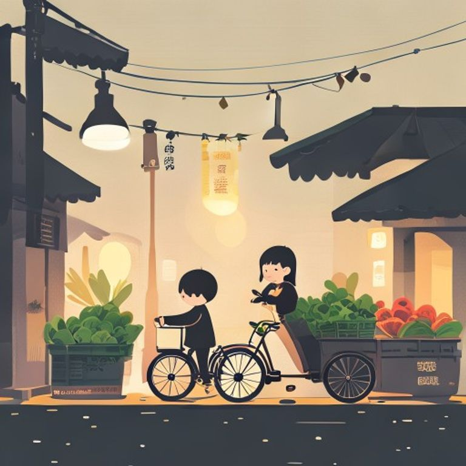

## 第1章：早市的燈

天還沒亮，老王就已經醒了。

他睜開眼睛，望了一眼窗外，還是黑的。

他坐起身，摸了枕頭下的老懷錶，發出輕微的「滴答」聲。

五點整。

他下了床，披上一件厚外套，打開門，走了出去。

外面的風很冷，但老王不怕。他已经在這個市場賣了三十二年的菜。

從小時候跟著父親賣，到現在自己一個人賣，已經成了習慣。

路燈還亮著，把他的影子拉得很長。

他推著那輛舊三輪車，車輪發出吱吱呀呀的聲音。

市場的門還沒開，但他知道，守門的李大爺已經在裡面等著他了。

「老王，今天來得早啊。」李大爺說道。

「习惯了，」老王笑了笑，「今天的白菜不錯。」

两人一邊聊著天，一邊走向自己的攤位。

老王把三輪車停在老位置，開始擺攤。青菜一筐一筐的搬下來，蘿蔔、白菜、芹菜、韭菜，整整齊齊的放好。

這時候，第一個客人來了。

是一個小姑娘，看起來只有十來歲，手裡拿著一個小錢包。

「伯伯，我要一把青菜。」她說道。

老王點點頭，給她裝了一把新鮮的小松菜。

「爺爺，」小姑娘問道，「你每天都在這裡嗎？」

「是啊，」老王說道，「從你爸爸小時候，我就一直在這裡了。」

小姑娘歪著頭，想了想，然後笑了。

「那我以後也要每天都來。」

說完，她轉身跑開了。

老王望著她的背影，笑了。

這個市場，見證了太多人的成長。

從小孩到大人，從年輕人到老人，都在這裡來來往往。

而他，就像是一個固定不移的燈塔，照亮著每一個早上的到來。

太陽漸漸升起來了。

市場熱鬧了起來。

賣肉的喊著「新鮮豬肉啊」，賣水果的喊著「好甜的水梨啊」，吆喝聲此起彼落。

老王坐在攤位後面，叼著一根烟，望著来来往往的人。

他忽然想起，年輕的時候，他也曾經想過，不要做這個生意。

要去外面闖一闖。

但父亲臨終前對他說：「老王啊，這個市場离不開你。在这里，才會有真正的生活。」

他聽了父亲的話，留下了。

現在想想，父親說的是對的。

在這裡，他見證了無數的婚禮、葬禮、升學、離別。

每一個人的故事，都跟他有關。

而這些故事，就像這市場的燈一樣，一盏一盞的，照亮著這座城市。

天亮了。

老王站起身，拍了拍裤子上的灰。

「今天也要繼續加油啊。」他自言自語的說道。

然後，他露出了笑容。

因為他知道，明天，這個市場，還會繼續。

就像他一樣。

---------

（卷一完）
