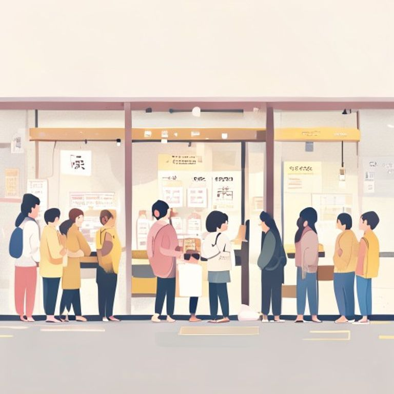

## 第13章：一排人

記憶形狀咖啡店門口，每天早上七點，都會出現一個排隊的隊伍。

不是為了搶限量商品，也不是為了等打折。那是一個老奶奶帶著一群年紀各異的人——有小學生、有上班族、有退休的阿伯——每個人手中都拿著一個小瓶子。

老奶奶姓陳，大家都叫她陳奶奶。她每天早上都會站在隊伍最前面，拿出一個小本子，點名。

「小美到了嗎？」她問道。

「到了！」一個小學生舉手。

「阿忠呢？」

「我在！」一個騎腳踏車的年輕人喊道。

「王伯伯？」

「老樣子，一杯黑咖啡，不加糖。」

陳奶奶滿意地點點頭，然後轉身走進咖啡店。

她點的单永远是最便宜的那一杯。但她會把店裡剩下的麵包全部買下來，分給隊伍裡的每一個人。

後來她才知道，陳奶奶的丈夫以前是這間店的老闆。他去世前說過：「店賣出去之後，我們的老客人就沒有家了。」於是陳奶奶每天早上組織這一排人，不是要喝咖啡，而是要讓大家知道——這個城市裡，還有人把他們放在心上。

---------

（屈民天地卷十三完）
