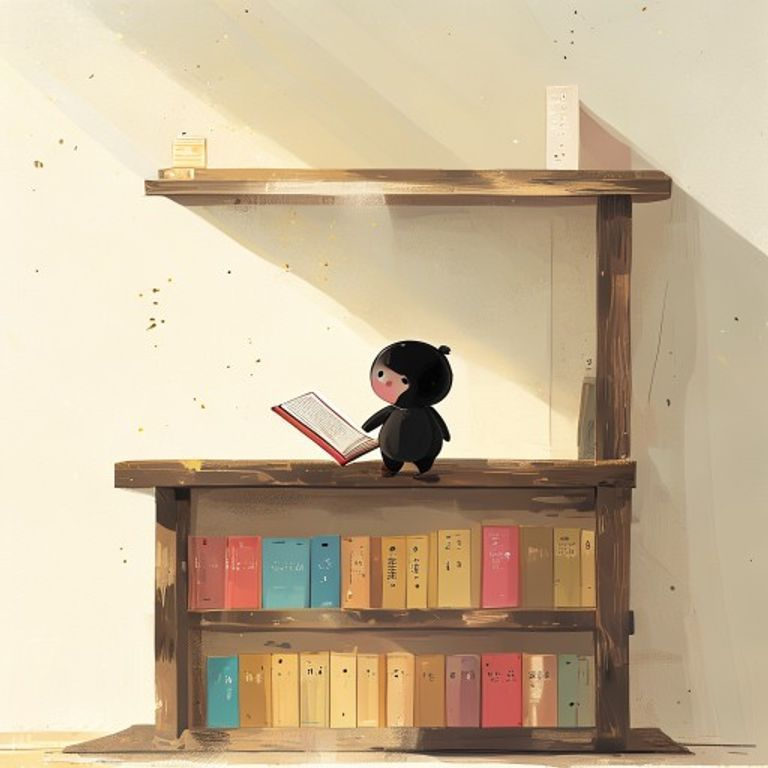

## 第15章：最後一層架子

便利商店的貨架邊，總是放著一些從來没有人買的東西。

過期的餅乾、缺了一角的巧克力、包裝已經褪色的茶葉。店員說，那是老闆的習慣——總是把一些「也許還有人需要」的東西留在架上，不願意下架。

她注意到了那些物品，有一天，她問老闆：

「這些東西為什麼不丟掉？」

老闆聳聳肩。

「因為總會有一個人，剛好需要它們。」

她沉默了很久。

那天晚上，她做了一個夢。夢見自己在一個無邊無際的書店裡，書架一直延伸到天花板。她在書架前徘徊了很久，終於在最上面一層，找到了一本寫著她名字的書。

醒來的時候，她決定寫一本屬於自己的故事。

---------

（屈民天地卷十五完）
