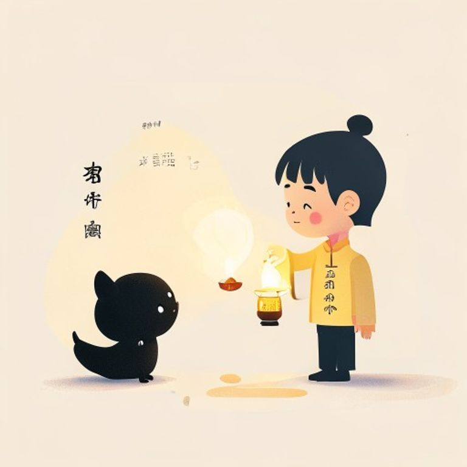

## 第20章：代代光

她最後一次見到阿婆，是在第二年燈火節的同一張長椅上。

阿婆的頭髮比去年白了，行動也慢了一些，但手裡的兔子燈，依舊是那盞熟悉的黃光。

「今年，我兒子回來了，」阿婆微笑著說道，「他在北方找到了工作，今年終於有時間回來看我。」

「那您先生呢？」她問道。

阿婆抬起頭，望著舞台上的燈火。

「他今天也在，」阿婆說道，「用風演奏。」

她的眼眶濕了。

她想到記憶形狀咖啡店的老闆、便利商店的阿姨、早餐店的板凳、天台上的鴿子老人。這些人，這些故事，像一條看不見的線，把整座城市緊緊地縫在一起。

她拿起筆，在笔记本的最後一頁，寫下了這句話：

「每个生命都是一盞燈。有人來，有人走，但燈火不會熄滅，因為總有人在記得。」

---------

（屈民天地卷二十完·第一部完）
