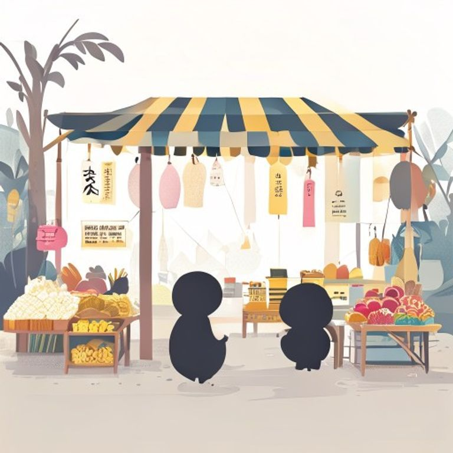

## 第21章：遠方市場

她決定去一趟遠方的市場。

那是城市另一端的一個古老市集，據說已經有上百年的歷史。她起了個大早，搭了四十分鐘的地鐵，又走了十五分鐘，才终于看到了那個入口。

市場的入口是一棵巨大的榕樹，樹枝上挂满了紅色的燈籠和Flag。進去之後，她發現這裡和家鄉的夜市非常相似——同樣的吆喝聲、同樣的食物香氣、同樣的人來人往。

她在一個賣手工飾品的攤位前停了下來。攤主是一個年輕人，手正忙著打磨一個木製的耳環。

「這是什麼木頭？」她問道。

「是櫻花木，」年輕人抬起頭，微笑著，「從家裡帶來的。我母親種了一棵櫻花樹，每年春天開花的時候，我就會採一些枝幹做成飾品。」

她買了一對耳環，戴在耳朵上。

走在市場裡，她忽然有了一種感覺——這座城市並沒有那麼大。每一個角落，都有人用各自的方式，守護著屬於自己的那片記憶。

---------

（屈民天地卷二十一完）
