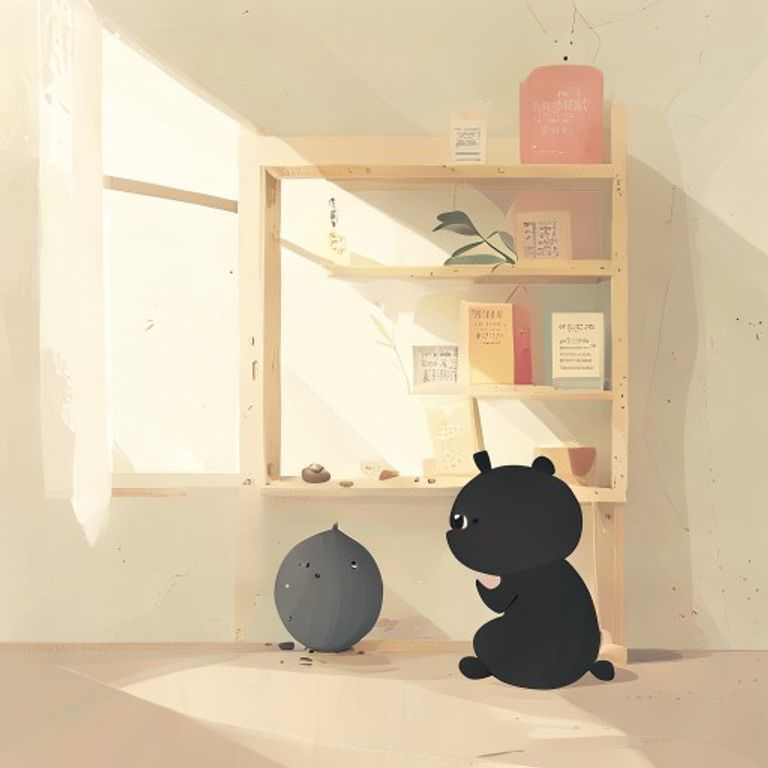

## 第27章：遺忘的架子

便利商店有一面牆，上面掛滿了顾客遺留下的物品。

雨傘、圍巾、手套、鑰匙、錢包，什麼都有。老闆把遺失物統統掛在牆上，用便利貼標註日期，等待有人來認領。

她第一次注意到那面牆，是因為她自己遺失了一條圍巾——米白色的，羊毛材質，是母亲送她的聖誕禮物。

她站在牆前，一項一項地尋找。沒有找到。

「沒關係，」老闆說道，「我會幫你留意著。」

從那天起，她每次經過便利商店，都會多看一眼那面牆。不看商品，不看別人，只看那一面遺忘的架子。

有一天，她看见围巾被挂在了最上面一排。老闆已经幫她洗过了，还系上了一个小小的蝴蝶结。

「謝謝你，」她說道，眼眶濕了。

「不用謝，」老闆說道，「遺忘的東西，總會有人幫你記得。」

---------

（屈民天地卷二十七完）
