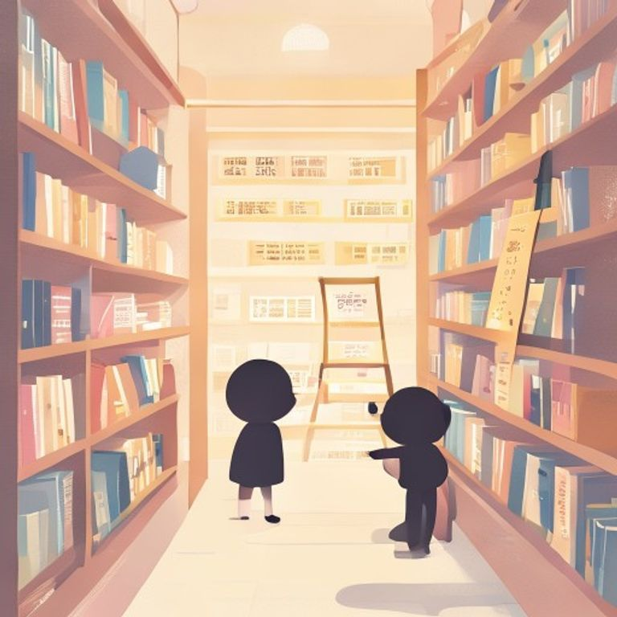

## 第28章：書店

她終於決定走進記憶形狀咖啡店旁邊那間從來沒有名字的書店。

那是一次偶然。她在便利商店買完東西，抬頭看了一眼對面，發現書店的門是開的。一種說不出的力量驅使她走了過去。

推開門的時候，風鈴響了一聲。屋內很暗，只有角落的一盞檯燈亮著，照亮了滿滿的書架。

老闆是一個戴眼鏡的中年人，正在櫃台後面寫著什麼。

「隨便看，」老闆說道，没有抬頭。

她在書架間走著，手指滑過一本本書的書背。這裡的書和一般书店不一樣——很多都没有出版社印記，有些甚至连作者都没有署名。

「這些是哪裡來的？」她問道。

「是客人留下的，」老闆說道，「每一個來這裡的人，都可以留下一本書，也可以帶走一本。這就是這個書店的規則。」

她望著老闆，忽然明白了什麼。

「你就是那個便利商店的……」

老闆點點頭。

「我同時經營兩家店，」他說道，「一家賣故事，一家收藏故事。」

她從書架上拿了一本書，沒有看書名，就直接帶回了咖啡店。後來她才知道，那本書裡夾著一張字條：

「寫下你的故事，留給下一個人。」

---------

（屈民天地卷二十八完）
