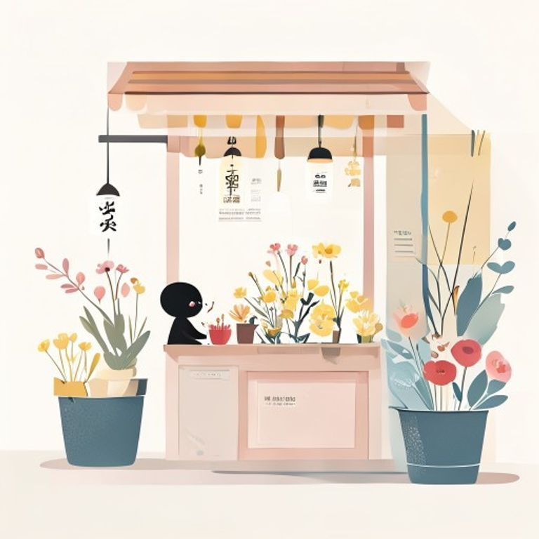

## 第30章：花店

歸鄉的那天，她在街角開了一家小小的花店。

店面很小，只有一個窗口和幾排木架，架上摆滿了當季的花。母親幫她打理生意，父亲則在门口种了一排玫瑰花。生活很簡單，卻是她多年以來最踏實的日子。

每天早上六點，她就會去花市挑花。水仙、向日葵、雏菊、玫瑰、绣球，依照季节的更替，店裡的花也會跟著變化。

有一對情侶每天都會路過，總是在橱窗前停下腳步。

「這些花怎麼賣？」有一天，男生問道。

「看你要哪一種，」她說道，「有些有價，有些無價。」

女生挑了兩枝向日葵。

「這兩枝，」她說道，「請你們帶去給今天吵架的人。向日葵會告訴她，太阳一直都在。」

兩人離開了。

她望著他們遠去的背影，忽然有了一種感覺——這個世界上的每一次相遇，每一次離別，每一次選擇，都像這些花一样，在某个時候，會剛好被某個人需要。

這就是她來到這個小鎮的意義。

---------

（屈民天地卷三十完·第二部完）
