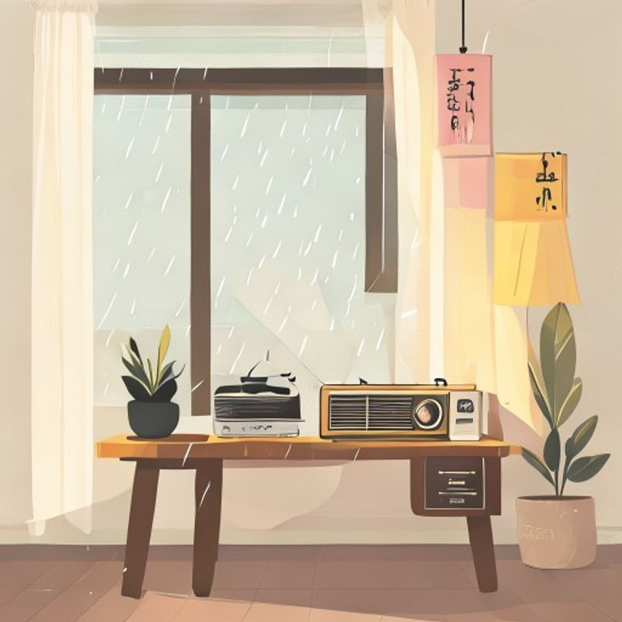

## 第4章：雨天的收音機

那台舊收音機是咖啡店唯一的老物。

它總是在下雨的時候自己打開，不需要任何人操作。店主說那是因為潮氣的關係，線路會自動接觸不良，進而發出聲音。但來店裡的客人卻寧願相信，那是某種神秘的力量在做祟。

她坐在窗邊，聽著收音機傳來断断续續的鋼琴聲。雨水沿著玻璃滑下來，像手指在畫板上輕輕划著。她忽然想起小時候，母親也會在下雨天打開收音機，聽同一首曲子。

「你也喜歡這首歌嗎？」老闆一邊擦著杯子一邊問道。

「嗯，」她點點頭，「我母親以前也常聽。」

老闆抬起頭，看了她一眼。

「是吗？」老闆說道，「我母亲以前也常聽。」

她愣住了。

老闆笑了笑。

「這首歌，」他說道，「是一個很老很老的廣播電台，每天晚上十點播的。现在已经停播了。」

她望著那台收音機，忽然有了一种說不出的感動。原來，某些聲音不会因為電台關閉而消失，它们只是躲進了雨裡，等待某個懂的人聽見。

---------

（屈民天地卷四完）
