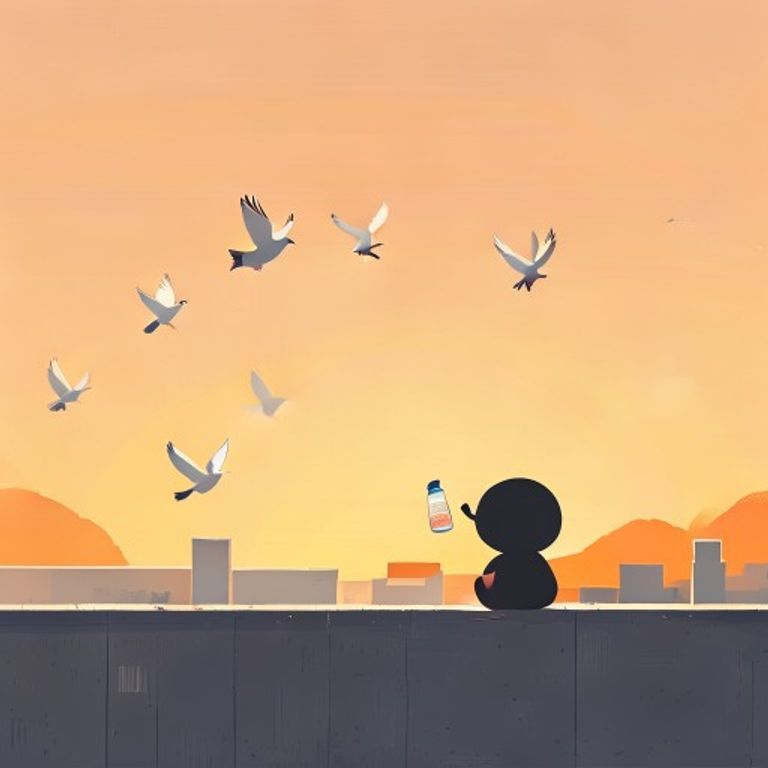

## 第5章：天台上的一杯水

她租的房间在三楼，没有电梯，楼顶的天台是对外开放的。

每天傍晚六點，太陽的餘暉會把整個天台染成橘紅色。她总是在這個時候跑上來，帶一瓶冰涼的礦泉水，坐在天台邊緣，望著遠方的城市燈火。

隔壁的屋頂上，住著一個養了一群鴿子的老人。每天這個時候，老人也會上來放鴿子。鴿子撲騰著翅膀飛起來的時候，陽光會被它們的羽毛反射，像一場小小的金色雨。

「你也喜歡上來看日落？」有一天，老人主動問道。

她點點頭。

「我來了三年了，」老人說道，「從來沒有見過有人上來。你是第一個。」

她愣了一下。

「你不怕高嗎？」老人又問道。

「不怕，」她說道，「在這裡，我覺得自己離天空很近。」

老人笑了笑，從随身的布袋裡拿出两颗糖，递給她一顆。

「以後上來的時候，我可以多帶一顆，」老人說道，「當作天台的會員費。」

她接過糖，笑了。

從那天起，每天傍晚六點，天台上都會有兩個人和一整片天空。

---------

（屈民天地卷五完）
