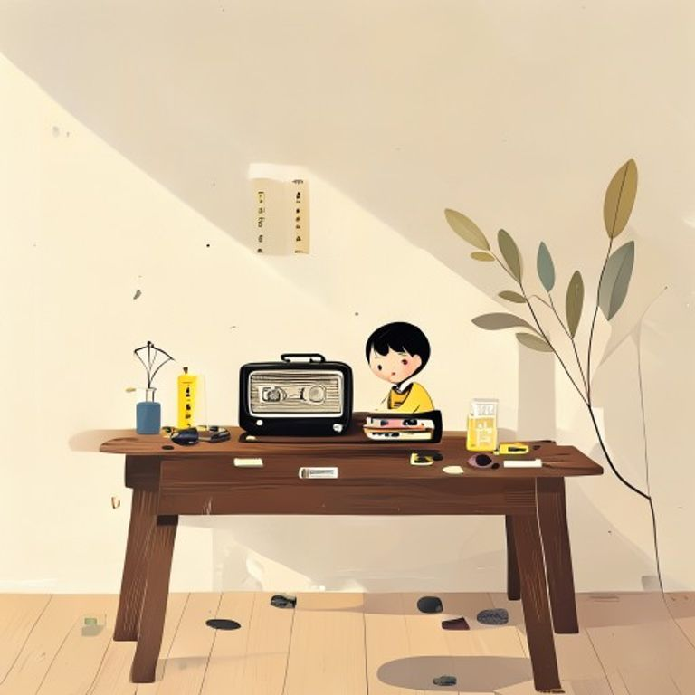

## 第8章：舊收音機

咖啡店的櫃台角落，放著一台舊收音機。

那是老闆從老家帶回來的，外殼磨損得很厲害，天線也斷了一半。但神奇的是，它還能收到節目——而且只有下雨的時候，才會傳出清晰的音樂。

她曾經問過老闆為什麼。

老闆搖搖頭。

「我也不知道，可能是因為老家的電台剛好在一個容易被雨水干擾的頻率上吧。下雨天的時候，音符會變得潮湿，聽起來比較溫柔。」

她信了。

從那天起，每当下雨，她就會站在櫃台旁邊，聽著那台收音機傳出來的音樂。有時候是爵士，有時候是古典，偶爾還會有一首她從來没有聽過的老歌。

「這是什麼歌？」她問道。

老闆抬頭聽了一會兒。

「這是我母親年輕時最愛唱的一首，」他說道，「她說，這首歌是在一個下雨天學會的。」

她望著老闆，忽然有了一種衝動——想知道這間店的每一个細節背後，都藏著怎樣的故事。

---------

（屈民天地卷八完）
